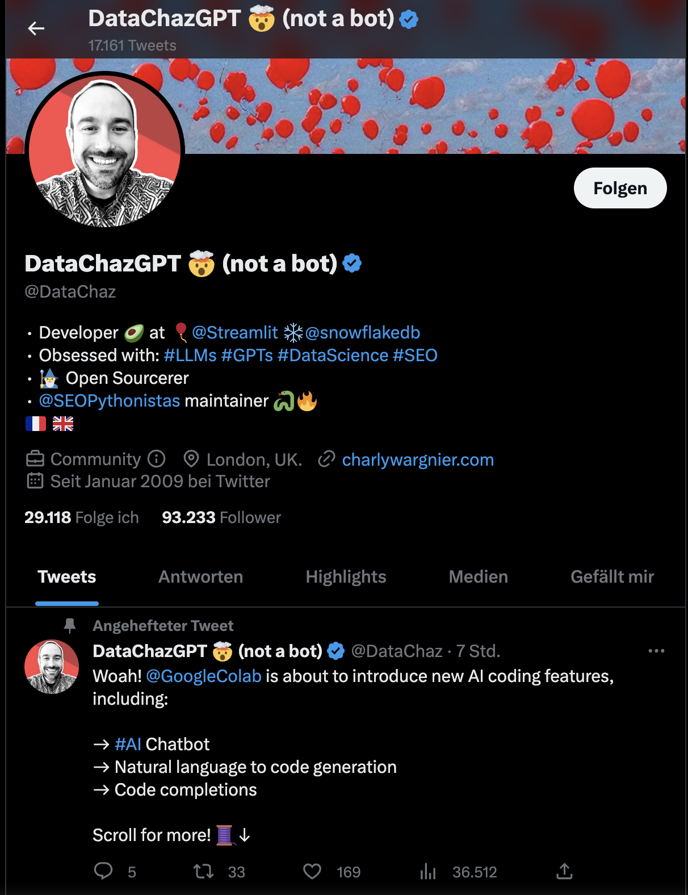

This research aims to explore and gain insights into Chat GPT, an advanced language model, through text mining of tweets. The dataset provided for this study consists of tweets collected between November 30, 2022, and January 29, 2023. With nearly 180,000 tweets at our disposal, a comprehensive analysis will be conducted to uncover valuable information.

The initial phase of this study involves a general analysis of the dataset, where patterns, trends, and key features will be identified. Following that, dictionaries will be defined, and automated content analysis techniques will be applied. This step will enable us to categorize and extract meaningful information from the tweets efficiently.

In the final stage, a sentiment analysis will be performed using the "syuzhet" method. This approach will allow us to assess the emotional tone and sentiment expressed in the tweets, providing a deeper understanding of the public perception and attitudes towards Chat GPT during the specified time period.

By leveraging the power of text mining and analyzing a substantial amount of Twitter data, this research aims to contribute to the existing knowledge about Chat GPT and provide valuable insights into its reception among Twitter users.

## Load packages and data

```{R}
library (syuzhet)
library (stringr)
library (tidyverse)
library (ggplot2)
library(scales)
library(stringi)
library(lubridate)
library(dplyr)
options(scipen=999)

load("ChatGPT.rda")
```

## 1. Question: What can you tell us about the users that tweet about ChatGPT?

```{R}
# Creating a copy of tweets
tweets_orig <- tweets

# take unique users
Users <- tweets[4:10]
Users = Users[!duplicated(Users$User),]

# Calculating average lenght of tweet
char_counts <- nchar(tweets$Tweet)
av_char_count <- mean(char_counts)
rounded_avg_char_count <- round(av_char_count, 2)

#create median
retweets_median = median(Users$Retweets)
retweets_mean = mean(Users$Retweets)

likes_median = median(Users$Likes)
likes_mean = mean(Users$Likes)

Friends_median = median(Users$UserFriends)
Friends_mean = mean(Users$UserFriends)

Followers_median = median(Users$UserFollowers)
Followers_mean = mean(Users$UserFollowers)

verified_median = median(Users$UserVerified)
verified_mean = mean(Users$UserVerified)

# Create a tibble with the values
my_table <- tibble(
  Statistic = c("Retweets", "Likes", "Friends", "Followers", "Verified"),
  Median = c(retweets_median, likes_median, Friends_median, Followers_median, 
             verified_median),
  Average = c(retweets_mean, likes_mean, Friends_mean, Followers_mean, 
              verified_mean)
)

print(my_table)
```
In the initial step, our focus was on analyzing the users who engaged with Chat GPT on Twitter. To ensure the accuracy of our analysis, we began by selecting unique user data, as there was a possibility that the same user may have tweeted about Chat GPT multiple times.

The resulting table provided us with valuable statistics on user engagement. By analyzing these user metrics, we gain insights into the reach, influence, and engagement levels of users discussing Chat GPT on Twitter. This information sets the foundation for a deeper understanding of user behavior and its potential impact on the perception and adoption of Chat GPT.


```{R}
# Count the number of tweets per user
tweet_counts <- as.data.frame(table(tweets$User))

# Rename the columns of the tweet_counts data frame
colnames(tweet_counts) <- c("User", "Tweet_Count")

# Create a new data frame with the number of tweets per user
multi_tweet_users <- tweet_counts[tweet_counts$Tweet_Count >= 1,]

# Create a table that shows the number of times each user has tweeted about Chat GPT
multi_tweet_table <- as.data.frame(table(multi_tweet_users$Tweet_Count))

# Rename the columns of the multi_tweet_table data frame
colnames(multi_tweet_table) <- c("Number_of_Tweets", "Number_of_Users")

multi_tweet_table
```
The generated table reveals that the majority of users only tweeted once about the topic. Surprisingly, only 19.64% of individuals tweeted a second time about Chat GPT. However, upon closer examination at the end of the table, it becomes evident that there are a few users who tweeted about it frequently. One particular user stands out, having tweeted 1325 times about Chat GPT within a span of 61 days, which is quite remarkable.

The frequency at which this person tweeted raises eyebrows. It implies that, on average, they posted a tweet every 66 minutes. Such prolific tweeting activity prompts curiosity and warrants further investigation into the motivations and circumstances behind their extensive engagement with Chat GPT.

This finding highlights the wide variation in user behavior when it comes to discussing Chat GPT on Twitter. While the majority of users exhibit minimal involvement, a small group demonstrates extraordinary dedication and interest in the topic.


In the next step, I want to determine which user has the highest number of retweeted tweets. By analyzing the dataset, I will identify the user whose tweets have been retweeted the most frequently. This information will provide insights into the user's influence and the impact of their tweets within the community. By identifying the user with the highest retweet count, we can gain valuable insights into the most engaging and influential content in our dataset.

```{R}
# Group the tweets by user and calculate the total retweets for each user
user_retweets <- tweets %>%
  group_by(User) %>%
  summarise(total_retweets = sum(Retweets)) %>%
  arrange(desc(total_retweets)) %>%
  top_n(10)

# Print the table
user_retweets

```

It is evident that the tweets by [DataChaz](https://twitter.com/DataChaz?ref_src=twsrc%5Egoogle%7Ctwcamp%5Eserp%7Ctwgr%5Eauthor) have been retweeted significantly more than others. DataChaz is a London-based developer who has been active on Twitter since 2009. He has a strong interest in Artificial Intelligence and regularly updates his 93,000 followers with valuable information in this domain. DataChaz often shares useful code snippets, allowing enthusiasts to explore various AI APIs and gain hands-on experience. The high retweet count indicates the relevance and impact of DataChaz's content, making him a prominent figure within the AI community on Twitter.



```{R}
# Create a table with the top 10 users with the highest tweet counts
top_10_users <- tweet_counts %>%
  arrange(desc(Tweet_Count)) %>%
  head(10)

# Print the top 10 users table
print(top_10_users)
```
We manually examined the users in the dataset, and it was observed that "MidJourneyAI_" had the highest number of tweets. However, upon closer inspection, it became apparent that this user had been repeatedly posting the same tweet using a bot. This behavior raises questions about the authenticity and motives behind their actions.

In contrast, the user with the second-highest number of tweets, "richardkimphd," appears to be a genuine account. This user predominantly shares tweets related to AI, indicating a keen interest in the topic. Their account reflects a high level of activity, suggesting that they are an active and engaged Twitter user.

These findings underscore the importance of discerning between automated or inauthentic accounts and genuine user engagement when analyzing Twitter data. Understanding the characteristics and behaviors of different users can help shed light on the broader dynamics and perspectives within the online AI community.

We decided to delete all multiple tweets before analyzing the data further.


```{R}
# Number of rows before removing duplicate tweets
before <- nrow(tweets)

# Remove rows with duplicate tweets
tweets_unique <- tweets[!duplicated(tweets$Tweet), ]

# Number of rows after removing duplicate tweets
after <- nrow(tweets_unique)

# Number of rows removed
removed <- before - after

# Display the number of removed rows
cat("The removal of duplicate tweets resulted in", removed, 
    "rows being removed.")

```
Fortunately, only 959 tweets were removed, which is not a significant loss considering the dataset size of nearly 180,000 tweets.

The removal of these tweets has minimal impact on the overall analysis and findings. With such a vast collection of tweets, the remaining dataset still provides ample data for conducting meaningful analyses and drawing reliable conclusions.


```{R}
# Average/ median of Hour when to tweet
# Create Histogramm for Tweettime
plot_dataHour <- tweets %>% 
  group_by (timeofday_hour) %>%
  count()

ggplot (plot_dataHour, 
        aes (x=timeofday_hour, y=n)) +
  geom_bar(stat = "identity")+
  theme_minimal () +
  ggtitle("Number of tweets over time (per hour)") +
  xlab("Hour") +
  ylab("Number of tweets")
```
It is evident from the plot that the number of tweets steadily increases from around noon and peaks at around 5 PM. This pattern suggests that most people engage in tweeting about the topic during their work hours.

The surge in tweet activity during the afternoon hours aligns with the assumption that individuals are actively discussing and sharing their thoughts on Chat GPT while they are at work or engaged in related activities.

However, starting from 6 PM, there is a noticeable decline in the number of tweets. This decrease could be attributed to the assumption that individuals tend to finish their workday around 5 PM and gradually shift their focus to other activities or responsibilities outside of work.

```{R}
#Number of follower
#range breaks
range_breaks <- c(0, 100, 500, 1500, 5000, 15000000)

#Appling cut() on follower-data
Users$range <- cut(Users$UserFollowers, breaks = range_breaks)

Users <- na.omit(Users)

# Creating Barplot
ggplot(Users, aes(x = range, fill = range)) + 
  geom_bar() + 
  labs(title = "Number of Twitter-Follower", x = "Range", y = "Number of users") + 
  scale_x_discrete(labels = c("0-100", "101-500", "501-1500", 
                              "1501-5000", "5000+")) +
  scale_y_continuous(labels = scales::comma_format()) +
  guides(fill = "none")

```
The graph depicting the number of followers per user reveals some interesting insights.

Firstly, it is noticeable that a significant portion of users, approximately 30,000 individuals, have a relatively low follower count ranging from 0 to 100. This suggests a large number of users with a limited reach or audience. Moving on, around 25,000 users fall into the range of 101 to 500 followers, indicating a moderate level of influence or popularity among this group.On the other hand, there is a smaller subset of approximately 8,000 users who boast a substantial following, surpassing 5,000 followers. These individuals likely possess a higher level of influence, attracting a significant number of people interested in their content or opinions.

Given these observations, our next step would involve diving deeper into the users with the highest number of followers. 

```{R}
top_users <- tweets %>%
  group_by(User) %>%
  summarise(Total_Tweets = n(),
            User_Followers = first(UserFollowers)) %>%
  arrange(desc(User_Followers)) %>%
  top_n(10)

top_users

```
It is interesting to observe that the majority of users in the top 10 list are from India. A few users originate from Pakistan, and one or two users represent the United States. This highlights the significant presence and influence of Indian users in the dataset, reflecting the popularity of these accounts among Twitter users in the region.

```{R}
#Number of tweets over time
plot_data <- tweets %>% 
  group_by (tweet_date) %>%
  count()

ggplot (plot_data, 
        aes (x=tweet_date, y=n)) +
  geom_bar(stat = "identity")+
  theme_minimal () +
  ggtitle("Number of tweets over time (per day)") +
  xlab("Date 22/23") +
  ylab("Number of tweets")
```

OpenAI has unveiled on the 3th of November the public beta launch of the DALL·E API, providing developers with the opportunity to incorporate DALL·E's image generation capabilities into their own applications and products. With DALL·E's remarkable adaptability, users can effortlessly produce and modify a diverse range of images, spanning from artistic renditions to convincingly lifelike representations.

We suspect that the reason for the relative calm on Twitter in early December was likely due to the public beta release of the DALL·E API. It is possible that there were significant discussions and debates about Chat GPT during the period from early November to early December, which gradually subsided. However, on December 8, OpenAI published a new piece of content that once again sparked discussions surrounding Chat GPT.

On December 8, OpenAI released an interview featuring Christian Gibson, an engineer on the Supercomputing team at the company. In the interview, he shares insights into his journey into engineering and how he became a part of OpenAI. Christian also discusses the specific challenges he focuses on addressing, such as the complexities involved in AI workflows and overcoming bottlenecks when running codes on supercomputers. He highlights what sets working on supercomputing at OpenAI apart from other places, such as the immense scale of the operation, and provides a glimpse into his typical day at OpenAI.

This practical and informative publication likely led to renewed discussions and conversations about Chat GPT.


```{R}
# Convert UserCreated to datetime format
Users$UserCreated <- ymd_hms(Users$UserCreated)

# Create the plot
ggplot(Users, aes(x = UserCreated)) + 
  geom_histogram(bins = 50, fill = "#69b3a2", color = "#e9ecef") +
  labs(x = "Account Creation Date", y = "Number of Accounts") +
  ggtitle("Twitter Account Creation Dates")

```
The plotted data of Twitter account creation reveals two noticeable peaks. The first peak occurred around 2009, which corresponds to a significant surge in user growth for Twitter. During this period, Twitter experienced a substantial influx of new users, marking a pivotal moment in its expansion and popularity.

The second peak in the plot can be attributed to the acquisition of Twitter by Elon Musk, a prominent figure in the tech industry. This event likely generated significant attention and media coverage, leading to a surge in user account creations.
Beyond these observations, the chart offers no other discernible insights or useful information.

## 2. What are the tweets about, what do users associated the new technology with (e.g. industries, specific applications, and also emotions)?

## Pre processing
```{R}
# Define a function to preprocess the text
preprocess_text <- function(text) {
  
  # Convert text to lower case
  text <- tolower(text)
  
  # Remove emojis and emoticons
  text <- gsub("[\U0001F600-\U0001F64F\U0001F910-\U0001F96F\U0001F300-\U0001F5FF\U0001F680-\U0001F6FF\U0001F1E0-\U0001F1FF]", "", text, perl=TRUE)
  
  # Remove numbers
  text <- gsub("\\d+", "", text)
  
  # Remove punctuation
  text <- gsub("[[:punct:]]", "", text)
  
  # Remove whitespace
  text <- gsub("\\s+", " ", text)
  
  # Remove stopwords and other words to be removed
  words_to_remove <- c("the", "and", "in", "to", "a", "of")
  words_to_remove_pattern <- paste0("\\b(", paste(words_to_remove, 
                                                  collapse = "|"), ")\\b")
  text <- gsub(words_to_remove_pattern, "", text, ignore.case = TRUE)
  
  # Return the preprocessed text
  return(text)
}

# Apply the preprocessing function to the Tweet column
tweets$preprocessed_text <- sapply(tweets$Tweet, preprocess_text)

```
In the steps seen above, we have performed preprocessing steps to clean and prepare the text data. The steps include converting the text to lowercase, removing emojis and emoticons, eliminating numbers, removing punctuation, reducing whitespace, and removing stopwords and other specified words. These preprocessing steps aim to standardize the text data and remove irrelevant elements, ensuring a cleaner and more consistent dataset for further analysis. Applying the preprocessing function to the "Tweet" column of the "tweets" dataset creates a new column called "preprocessed_text," which contains the preprocessed text ready for the analysis.

## Automated Content Analysis
```{R}
# Select text column and create your custom dictionaries
# Dictionary 1: Education
tweets$dic1 <- str_count(tweets$preprocessed_text, 
"education|learning|school|students|teachers|classroom|knowledge|
university|academic|skills|curriculum|research|study|online learning|
student loans|exam")
tweets$dic1_occurrence <- ifelse(tweets$dic1 >= 2, 1, 0)

# Dictionary 2: Consulting Company, Digital Transformation
tweets$dic2 <- str_count(tweets$preprocessed_text, 
"consulting|company|digitaltransformation|strategy|innovation|technology|
business|data analytics|automation|change management|customer experience|
digitalization|leadership|agile|disruption")
tweets$dic2_occurrence <- ifelse(tweets$dic2 >= 2, 1, 0)

# Dictionary 3: Industry, Factories
tweets$dic3 <- str_count(tweets$preprocessed_text, 
"factor|manufacturing|production|supply chain|logistics|machinery|
automation|quality control|assembly line|efficiency|process optimization|
industrial revolution|industrial engineering|industrialization|logistic|industry")
tweets$dic3_occurrence <- ifelse(tweets$dic3 >= 2, 1, 0)

# Dictionary 4: Art
tweets$dic4 <- str_count(tweets$preprocessed_text,
"art|artists|painting|sculpture|photography|creativity|exhibition|museum|
aesthetics|expression|visual arts|contemporary art|performance art|art gallery|
artistic expression")
tweets$dic4_occurrence <- ifelse(tweets$dic4 >= 2, 1, 0)

# Dictionary 5: Finance, Banking
tweets$dic5 <- str_count(tweets$preprocessed_text, 
"finance|banking|financial services|investment|money|loans|savings|credit cards|
wealth management|financial planning|insurance|retirement|mortgage|
asset management|banking sector")
tweets$dic5_occurrence <- ifelse(tweets$dic5 >= 2, 1, 0)

# Calculate the sums of occurrences for each dictionary
sum(tweets$dic1_occurrence)
sum(tweets$dic2_occurrence)
sum(tweets$dic3_occurrence)
sum(tweets$dic4_occurrence)
sum(tweets$dic5_occurrence)

```

```{R}
## VISUALIZE RESULTS dictionary 1 (Education)
#sum of reviews that cover topic per day
plot_content_data1 <- tweets %>% 
  group_by (tweet_date) %>%
  summarise(n_content=sum(dic1_occurrence))

ggplot (plot_content_data1, aes (x=tweet_date, y=n_content)) + 
  geom_bar(stat = "identity")+ theme_minimal () + 
  ggtitle("Number of reviews covering the topic 1 'education' (per day)")
```
Initially, there was no particular upward trend, but from January onwards, the data regarding the "education" dictionary saw a significant surge. This is likely due to the realization that ChatGPT can be effectively employed in the education sector, not only in positive aspects but also in negative ones. However, it should be noted that its usage may lead to the potential elimination of learning effects among students or a reduction in diligence in completing assignments.

```{R}
## VISUALIZE RESULTS dictionary 2 (Consulting Company, Digital Transformation)
#sum of reviews that cover topic per day
plot_content_data2 <- tweets %>% 
  group_by (tweet_date) %>%
  summarise(n_content=sum(dic2_occurrence))

ggplot (plot_content_data2, aes (x=tweet_date, y=n_content)) + 
  geom_bar(stat = "identity")+ theme_minimal () + 
  ggtitle("Number of reviews covering the topic 2 'Consulting Company, 
Digital Transformation' (per day)")
```
In the second dictionary, we attempted to filter for consulting companies. By the end of the year in December, there is no significant hype or trend observable. However, starting from January to February, a clear hype becomes apparent, and the number of tweets has significantly increased. This trend in January is driven by the fact that ChatGPT is highly intriguing and applicable to consulting and its industry.

```{R}
## VISUALIZE RESULTS dictionary 3 (Industry, Factories)
#sum of reviews that cover topic per day
plot_content_data3 <- tweets %>% 
  group_by (tweet_date) %>%
  summarise(n_content=sum(dic3_occurrence))

ggplot (plot_content_data3, aes (x=tweet_date, y=n_content)) + 
  geom_bar(stat = "identity")+ theme_minimal () + 
  ggtitle("Number of reviews covering the topic 3 'Industry, Factories' (per day)")
```
We created a dictionary consisting of words related to the industry and factories. However, we found very few tweets containing these specific words. As a result, this graph does not provide substantial insights. ___Therefore, we have decided to disregard this particular dictionary.___

Additionally, we manually reviewed some tweets from this industry and experimented with other words as part of the dictionary. However, the only conclusion we can draw is that there was a limited amount of tweets discussing the industry and factories in connection with Chat-GPT.

```{R}
## VISUALIZE RESULTS dictionary 4 (Art)
#sum of reviews that cover topic per day
plot_content_data4 <- tweets %>% 
  group_by (tweet_date) %>%
  summarise(n_content=sum(dic4_occurrence))

ggplot (plot_content_data4, aes (x=tweet_date, y=n_content)) + 
  geom_bar(stat = "identity")+ theme_minimal () + 
  ggtitle("Number of reviews covering the topic 4 'Art' (per day)")
```
In the "art" dictionary, we can observe a general trend where the number of tweets has increased regarding ChatGPT. However, it is challenging to determine why this surge specifically relates to the art industry. Therefore, a trend is apparent, but it aligns with the overall number of tweets about ChatGPT and does not signify a specific trend in the art industry.

```{r}
## VISUALIZE RESULTS dictionary 5 (Finance, Banking)
#sum of reviews that cover topic per day
plot_content_data5 <- tweets %>% 
  group_by (tweet_date) %>%
  summarise(n_content=sum(dic5_occurrence))

ggplot (plot_content_data5, aes (x=tweet_date, y=n_content)) + 
  geom_bar(stat = "identity")+ theme_minimal () + 
  ggtitle("Number of reviews covering the topic 5 'Finance, Banking' (per day)")
```

In December, the tweets related to the finance and banking industry are below the average trends of tweets about ChatGPT. However, starting from January, a clear upward trend becomes apparent, with significant spikes in the middle of the month. This is likely because the finance and banking sector is traditionally considered a slow-moving industry. Nevertheless, it becomes evident that even in these sectors, ChatGPT or artificial intelligence can and will bring about a significant transformation.

# How did the excitement and topics developed over time?

## Senitment Analysis
```{R}
# Define a function to calculate sentiment using the syuzhet package
calculate_sentiment <- function(text) {
  # Calculate sentiment using the "syuzhet" package
  sentiment_scores <- get_sentiment(text, method = "syuzhet")
  
  # Return the mean sentiment score
  return(mean(sentiment_scores))
}

# Apply the sentiment function to the preprocessed tweets
tweets$sentiment <- sapply(tweets$preprocessed_text, calculate_sentiment)

# Filter data based on the specified date
filtered_tweets <- tweets %>%
  filter(tweet_date >= as.POSIXct("2022-12-01 00:00:00"))

# Calculate the mean sentiment over time
plot_sentiment_data <- filtered_tweets %>% 
  group_by(tweet_date) %>%
  summarise(n_sentiment = mean(sentiment))

# Plot the analysis
ggplot (plot_sentiment_data, aes (x=tweet_date, y=n_sentiment)) + 
  geom_line()+ theme_minimal () + 
  ggtitle("Sentiment scores over time (mean per day)")
```
We have chosen to select data starting from December 1, 2022, for the sentiment analysis plot. This decision was made because in the initial days of the dataset, there were relatively few users tweeting. Including these few users would heavily skew the overall sentiment analysis. The plot reveals a gradual increase in the n_sentiment from 0.6, eventually leading to a prominent peak around the end of 2022, reaching approximately 0.875. From there, until the end of the dataset in late January 2023, the n_sentiment remained consistently around 0.7. This trend suggests a notable shift in sentiment towards more positive or favorable expressions related to the topic of discussion captured in the tweets during the analyzed period.


In addition to analyzing all tweets, we are interested in how the attitudes about chat GPT were in the areas we defined. 

```{R}
# Filter data based on the specified date
filtered_tweets <- tweets %>%
  filter(tweet_date >= as.POSIXct("2022-12-01 00:00:00"), dic1_occurrence == 1)

# Calculate the mean sentiment over time
plot_sentiment_data <- filtered_tweets %>% 
  group_by(tweet_date) %>%
  summarise(n_sentiment = mean(sentiment))

# Plot the analysis
ggplot (plot_sentiment_data, aes (x=tweet_date, y=n_sentiment)) + 
  geom_line()+ theme_minimal () +
  ggtitle("Sentiment scores over time (mean per day)
Dictionary 1 (Education)")
```
In the sentiment analysis of the education domain, a slight negative trend can be observed. Although the sentiment score is above 0.75, indicating a generally positive sentiment, the decreasing trend suggests a slightly declining sentiment over time.

```{R}
# Filter data based on the specified date
filtered_tweets <- tweets %>%
  filter(tweet_date >= as.POSIXct("2022-12-01 00:00:00"), dic2_occurrence == 1)

# Calculate the mean sentiment over time
plot_sentiment_data <- filtered_tweets %>% 
  group_by(tweet_date) %>%
  summarise(n_sentiment = mean(sentiment))

# Plot the analysis
ggplot (plot_sentiment_data, aes (x=tweet_date, y=n_sentiment)) + 
  geom_line()+ theme_minimal () + 
  ggtitle("Sentiment scores over time (mean per day)
Dictionary 2 (Consulting Company, Digital Transformation)")
```

In the sentiment analysis of the education domain, a slight negative trend can be observed. Although the sentiment score is above 1.5, indicating a generally positive sentiment, the decreasing trend suggests a slightly declining sentiment over time.

```{R}
# Filter data based on the specified date
filtered_tweets <- tweets %>%
  filter(tweet_date >= as.POSIXct("2022-12-01 00:00:00"), dic4_occurrence == 1)

# Calculate the mean sentiment over time
plot_sentiment_data <- filtered_tweets %>% 
  group_by(tweet_date) %>%
  summarise(n_sentiment = mean(sentiment))

# Plot the analysis
ggplot (plot_sentiment_data, aes (x=tweet_date, y=n_sentiment)) + 
  geom_line()+ theme_minimal () + 
  ggtitle("Sentiment scores over time (mean per day)
Dictionary 4 (Art)")
```

In the following sentiment analysis, it was observed that the overall sentiment value is consistently positive, with a very extreme outlier at the end of December in both positive and negative directions. However, there is a general decrease in the sentiment score from 1.25 to 1.0 in the sentiment analysis value.

```{R}
# Filter data based on the specified date
filtered_tweets <- tweets %>%
  filter(tweet_date >= as.POSIXct("2022-12-01 00:00:00"), dic5_occurrence == 1)

# Calculate the mean sentiment over time
plot_sentiment_data <- filtered_tweets %>% 
  group_by(tweet_date) %>%
  summarise(n_sentiment = mean(sentiment))

# Plot the analysis
ggplot (plot_sentiment_data, aes (x=tweet_date, y=n_sentiment)) + 
  geom_line()+ theme_minimal () + 
  ggtitle("Sentiment scores over time (mean per day)
Dictionary 5 (Finance, Banking)")
```

In the recent sentiment analysis number 5, focusing on the finance and banking sector, the values are also positive, with a sentiment score ranging from 1 until the end of the analysis period, reaching 0.75. However, there is a highly negative outlier at the beginning of December, where the sentiment score drops below -1.


Antworten für Frage 4. (einfach nur kopiert aus Chat-GPT, muss noch angepasst werden!!!)

As a consulting company, there are several ways you can leverage ChatGPT in client projects:

1. Virtual Assistants: ChatGPT can be used to develop virtual assistants that can handle customer queries, provide personalized recommendations, and assist with basic tasks. This can enhance customer experience and improve operational efficiency.

2. Content Generation: ChatGPT can be utilized to generate content such as blog posts, social media updates, or product descriptions. This can save time and effort in creating engaging and informative content.

3. Language Translation: ChatGPT's language capabilities can be leveraged for language translation tasks, enabling clients to reach a wider audience and expand their global presence.

4. Sentiment Analysis: Besides sentiment analysis of existing data, ChatGPT can be used to analyze social media conversations, customer feedback, or online reviews to gain insights into customer sentiment and identify areas for improvement.

5. Personalization: By integrating ChatGPT into client projects, you can enable personalized experiences for users, tailoring recommendations, suggestions, or product offerings based on individual preferences and behaviors.

Regarding the feasibility of using ChatGPT in client projects, it is crucial to consider factors such as the specific project requirements, data availability, and ethical considerations. While ChatGPT can bring significant benefits, it is important to evaluate the model's limitations and potential biases to ensure its appropriate use.

In summary, ChatGPT can be a valuable tool in various consulting projects, providing opportunities for enhanced customer experiences, content generation, language translation, sentiment analysis, and personalization. However, careful evaluation, customization, and addressing ethical considerations are essential to maximize the benefits and mitigate any potential challenges.

## Additional analysis

```{R}
#correlation of sentiment with custom dictionary
cor(tweets$dic1, tweets$Likes, method = "pearson")
cor(tweets$dic1, tweets$sentiment, method = "pearson")
cor(tweets$dic2, tweets$Likes, method = "pearson")
cor(tweets$dic2, tweets$sentiment, method = "pearson")
cor(tweets$dic3, tweets$Likes, method = "pearson")
cor(tweets$dic3, tweets$sentiment, method = "pearson")
cor(tweets$dic4, tweets$Likes, method = "pearson")
cor(tweets$dic4, tweets$sentiment, method = "pearson")
cor(tweets$dic5, tweets$Likes, method = "pearson")
cor(tweets$dic5, tweets$sentiment, method = "pearson")
```